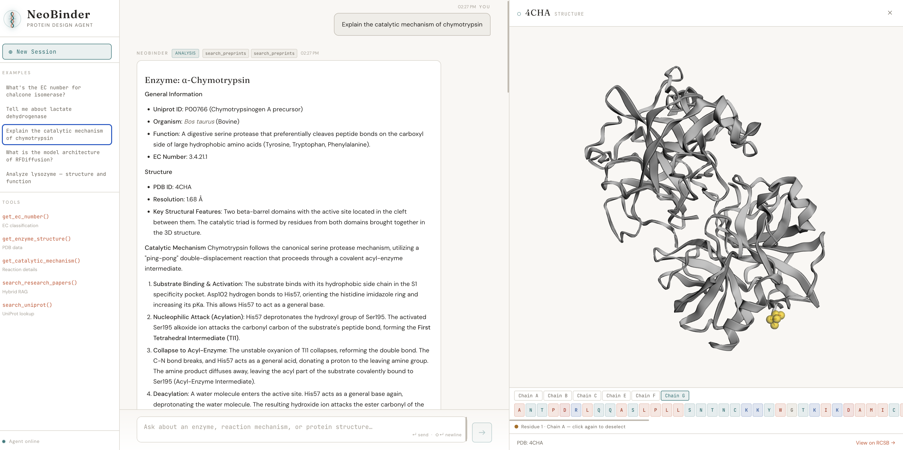

# Protein Design Research Agent

An AI-powered assistant for protein engineering and enzyme design research. Integrates **RAG (Retrieval-Augmented Generation)** with **agentic workflows** (LangGraph) and a modern React interface for querying protein databases, searching literature, and visualizing 3D structures.



---

## Features

### Intelligent Query Routing with Planning
The LangGraph agent classifies every query and routes it through the appropriate path:
- **Simple** — fast EC number lookups via a lightweight router model
- **Detailed** — a planner decomposes the query into structured steps, independent steps run in parallel, then the worker model synthesizes findings
- **Research** — hybrid RAG over local PDF library, parallel tool gathering, then detailed analysis

The **planning node** (`plan_query`) produces a JSON plan specifying which tools to call, their arguments, and dependency ordering. The **parallel gather** node (`parallel_gather`) executes independent steps concurrently via `ThreadPoolExecutor`, reducing latency proportional to the number of data sources.

### Hybrid RAG Pipeline
- **Vector search** via PubMedBERT embeddings (`neuml/pubmedbert-base-embeddings`)
- **BM25 keyword search** fused with Reciprocal Rank Fusion (k=60)
- PDF processing with **Docling** -> Markdown -> `MarkdownHeaderTextSplitter` + `RecursiveCharacterTextSplitter`
- Supports both **ChromaDB** (local) and **Pinecone** (cloud) backends
- Chunks are prefixed with `Paper Title | Section` for context enrichment

### MCP-style Tool Servers
Modular servers in `mcp_servers/` each expose search/lookup methods:

| Server | Data source |
|--------|-------------|
| `ec/` | ExplorEnz -- EC number classification |
| `pdb/` | RCSB GraphQL -- structure data |
| `uniprot/` | UniProt REST -- sequences & annotations |
| `arxiv/` | arXiv Atom feed |
| `biorxiv/` | EuropePMC REST |

### Skill System
Create a subdirectory in `agent/skills/` with a `SKILL.md` file (e.g., `agent/skills/enzyme_analysis/SKILL.md`) and the router automatically gains the ability to select it. The directory name is the skill key. The file's content is injected as a system prompt for the detailed handler -- no code changes needed.

### React Frontend
A custom React/TypeScript/Vite UI served through a FastAPI SSE streaming backend.

- Live **pipeline status bar** showing agent routing -> planning -> tools -> response in real time
- Full **Markdown rendering** with syntax-highlighted code blocks
- Automatic **PDB ID detection** in responses with one-click structure loading
- **3D protein viewer** (3Dmol.js) with rainbow cartoon rendering
  - Drag the left border to resize the panel (280-900 px)
  - **Sequence strip** showing residues color-coded by type (hydrophobic / polar / charged / glycine)
  - Click any residue to highlight it in the 3D view with a gold sphere overlay
- **Cancel button** -- stop a running query at any time (Escape key or click the stop button). Aborts the SSE stream client-side and signals the backend to halt the agent thread.
- Persistent conversation memory via `SqliteSaver` (per session `thread_id`)

### Redis Caching
Two-tier caching system that speeds up repeated and similar queries:

- **Tool call caching** -- external API results (UniProt, PDB, arXiv, bioRxiv, EC) are cached in Redis with per-tool TTLs (1-30 days). Shared across all Gunicorn workers.
- **Query-level caching** -- full agent responses are cached and matched by exact text or semantic similarity (cosine >= 0.95 via PubMedBERT embeddings). Similar rephrased queries return instantly.
- **Graceful degradation** -- if Redis is unavailable, the agent works normally without caching.
- **Admin endpoints** -- `GET /api/cache/stats` for hit/miss metrics, `POST /api/cache/clear` to flush cache.
- **Auto-invalidation** -- RAG cache entries are cleared automatically when PDFs are re-indexed.

---

## Agent Graph

[View interactive graph](public/agent_graph.html)

```
Simple:   START -> route_query -> simple_handler <-> tools -> END
Detailed: START -> route_query -> plan_query -> parallel_gather -> detailed_handler <-> tools -> END
Research: START -> route_query -> plan_query -> rag_handler -> parallel_gather -> detailed_handler <-> tools -> END
```

**Key nodes:**
- `route_query` -- classifies the query and selects a skill; clears stale state from prior turns
- `plan_query` -- uses the router LLM to produce a structured JSON execution plan
- `parallel_gather` -- executes independent plan steps concurrently (up to 4 workers)
- `rag_handler` -- retrieves relevant paper excerpts from the local indexed PDF library
- `simple_handler` / `detailed_handler` -- LLM nodes that call tools and generate responses
- `tools` -- LangGraph `ToolNode` executing tool calls

---

## Technology Stack

| Layer | Technology |
|-------|-----------|
| Frontend | React 18, TypeScript, Vite |
| Styling | Pure CSS (Fraunces + DM Sans + JetBrains Mono) |
| 3D Viewer | 3Dmol.js (CDN) |
| API server | FastAPI + Uvicorn/Gunicorn (SSE streaming) |
| Agent | LangGraph `StateGraph`, `SqliteSaver` checkpointer |
| LLM | OpenAI-compatible (Zenmux) -- configurable router + worker models |
| RAG -- local | ChromaDB + BM25 |
| RAG -- cloud | Pinecone + BM25 |
| Embeddings | PubMedBERT microservice (FastAPI, port 8000) |
| PDF processing | Docling -> Markdown |
| Caching | Redis (tool results + query-level semantic dedup) |
| Observability | LangSmith (optional) |

---

## Project Structure

```
protein-design-agent/
├── agent/
│   ├── agent.py              # LangGraph StateGraph + planning + parallel gather
│   ├── cache.py              # Redis caching (tool results + query-level dedup)
│   ├── skills/               # {skill_name}/SKILL.md (auto-discovered)
│   └── rag/
│       ├── chroma_rag.py
│       ├── pinecone_rag.py
│       ├── pdf_processing.py
│       └── rag_cli.py
├── mcp_servers/
│   ├── ec/server.py
│   ├── pdb/server.py
│   ├── uniprot/server.py
│   ├── arxiv/server.py
│   └── biorxiv/server.py
├── frontend/                 # React/TypeScript/Vite app
│   ├── src/
│   │   ├── App.tsx
│   │   ├── components/
│   │   │   ├── Sidebar.tsx
│   │   │   ├── ChatArea.tsx       # Send/cancel button, Escape shortcut
│   │   │   ├── MessageBubble.tsx
│   │   │   ├── PipelineStatus.tsx
│   │   │   └── ProteinViewer.tsx
│   │   ├── hooks/useChat.ts       # SSE streaming, AbortController cancel
│   │   ├── types/index.ts
│   │   └── styles/globals.css
│   ├── package.json
│   └── vite.config.ts             # proxies /api -> localhost:8001
├── tests/
│   └── test_agent_graph.py        # Graph structure + feature tests
├── deploy/                        # All deployment files
│   ├── Dockerfile
│   ├── Dockerfile.embedding
│   ├── Dockerfile.frontend
│   ├── docker-compose.prod.yml
│   └── nginx/nginx.conf
├── api.py                         # FastAPI SSE backend (port 8001)
├── embedding_service.py           # PubMedBERT microservice (port 8000)
├── data/
│   ├── papers/                    # Place PDFs here
│   ├── chroma_db/
│   ├── bm25/
│   └── checkpoints.db
└── pyproject.toml
```

---

## Setup

### Prerequisites
- Python 3.13+
- Node.js 20+
- `uv` (recommended) or `pip`

### 1. Install Python dependencies

```bash
uv sync
```

### 2. Configure environment

Create `.env` in the project root:

```env
ZENMUX_API_KEY=...
ZENMUX_BASE_URL=...          # defaults to https://api.zenmux.com/v1
ROUTER_MODEL=gpt-4o-mini
WORKER_MODEL=gpt-4o
RAG_BACKEND=chroma           # or pinecone
EMBEDDING_SERVICE_URL=http://localhost:8000/embed
PINECONE_API_KEY=...         # only needed for Pinecone backend
PINECONE_INDEX_NAME=paper-rag-index
LANGCHAIN_API_KEY=...        # optional, enables LangSmith tracing
REDIS_URL=redis://localhost:6379/0  # optional, enables caching
CACHE_SIMILARITY_THRESHOLD=0.95     # optional, cosine threshold for query dedup
```

### 3. Install frontend dependencies

```bash
cd frontend && npm install
```

---

## Running Locally

**Optional -- Start Redis** (for caching, not required):
```bash
docker run -d -p 6379:6379 redis:7-alpine
# Or: brew services start redis
```

Three processes are needed. Open three terminals from the project root:

**Terminal 1 -- Embedding microservice** (required for RAG):
```bash
python embedding_service.py
# Serves PubMedBERT on http://localhost:8000
```

**Terminal 2 -- FastAPI backend**:
```bash
uvicorn api:app --reload --port 8001
```

**Terminal 3 -- React dev server**:
```bash
cd frontend && npm run dev
# Opens http://localhost:5173
# /api/* is proxied to the FastAPI backend automatically
```

### Index PDFs (one-time, after adding papers to `data/papers/`)

```bash
# ChromaDB (default)
python -m agent.rag.rag_cli --backend chroma --index

# Pinecone
python -m agent.rag.rag_cli --backend pinecone --index

# Force full reindex
python -m agent.rag.rag_cli --backend chroma --index --reindex

# Verify
python -m agent.rag.rag_cli --backend chroma --search "RFDiffusion architecture"
```

### Run tests

```bash
uv run python tests/test_agent_graph.py
```

---

## API Endpoints

| Method | Path | Description |
|--------|------|-------------|
| `POST` | `/api/chat` | Stream an agent response (SSE). Body: `{ message, thread_id }` |
| `POST` | `/api/chat/cancel` | Cancel an in-flight query. Body: `{ thread_id }` |
| `GET` | `/api/health` | Health check |
| `GET` | `/api/cache/stats` | Cache hit/miss metrics |
| `POST` | `/api/cache/clear` | Clear cache. Query param: `cache_type=tool\|query\|all` |

### SSE Event Types

| Event | Data | Description |
|-------|------|-------------|
| `route` | `{ query_type, skill_name }` | Query classified |
| `status` | `{ message }` | Status update (e.g., RAG search) |
| `tool` | `{ tool_name }` | Tool execution started |
| `response` | `{ content }` | Response content (may stream incrementally) |
| `cancelled` | `{ message }` | Query was cancelled |
| `done` | `{}` | Stream complete |
| `error` | `{ message }` | Error occurred |

---

## Deployment (Docker, ~100 users)

All deployment files live in `deploy/`. The recommended target is a **4 vCPU / 8 GB RAM** VM.

```bash
# From the project root
docker compose -f deploy/docker-compose.prod.yml up -d --build

# Index PDFs after first deploy
docker compose -f deploy/docker-compose.prod.yml exec api \
  python -m agent.rag.rag_cli --backend chroma --index
```

The compose stack:
- **nginx** -- serves the built React app as static files and reverse-proxies `/api/` to the FastAPI service (SSE buffering disabled)
- **api** -- 4 Gunicorn/Uvicorn workers, SQLite WAL for shared conversation state
- **redis** -- shared cache for tool results and query dedup (256 MB, LRU eviction)
- **embedding-service** -- PubMedBERT model, cached to a named volume

See `deploy/nginx/nginx.conf` for SSL configuration notes.

---

## Example Queries

| Type | Query |
|------|-------|
| Simple | "What's the EC number for chalcone isomerase?" |
| Detailed | "Explain the catalytic mechanism of chymotrypsin" |
| Structure | "Tell me about lysozyme" -> opens 3D viewer automatically |
| Research | "What is the model architecture of RFDiffusion?" |
| UniProt | "Get the amino acid sequence of human hexokinase-1" |
